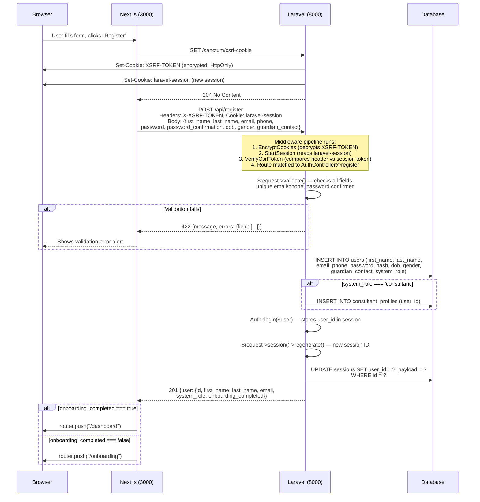
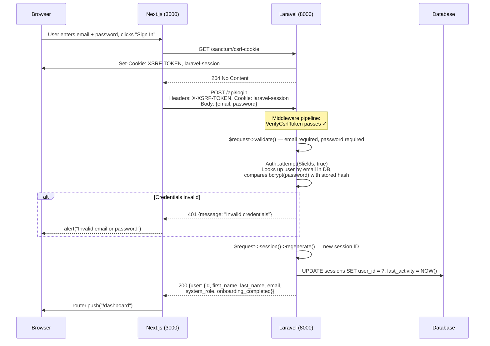
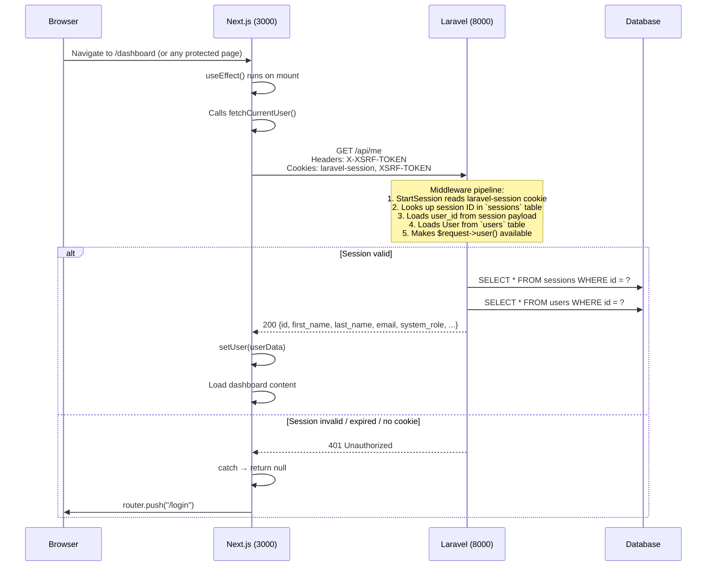
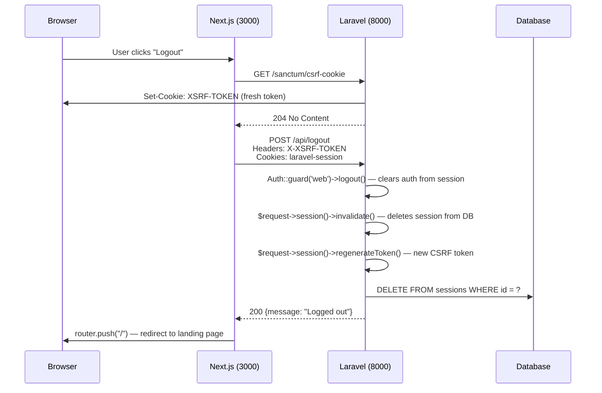
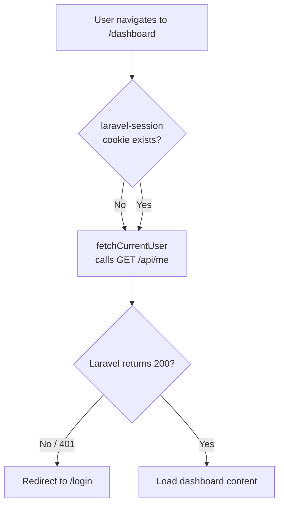
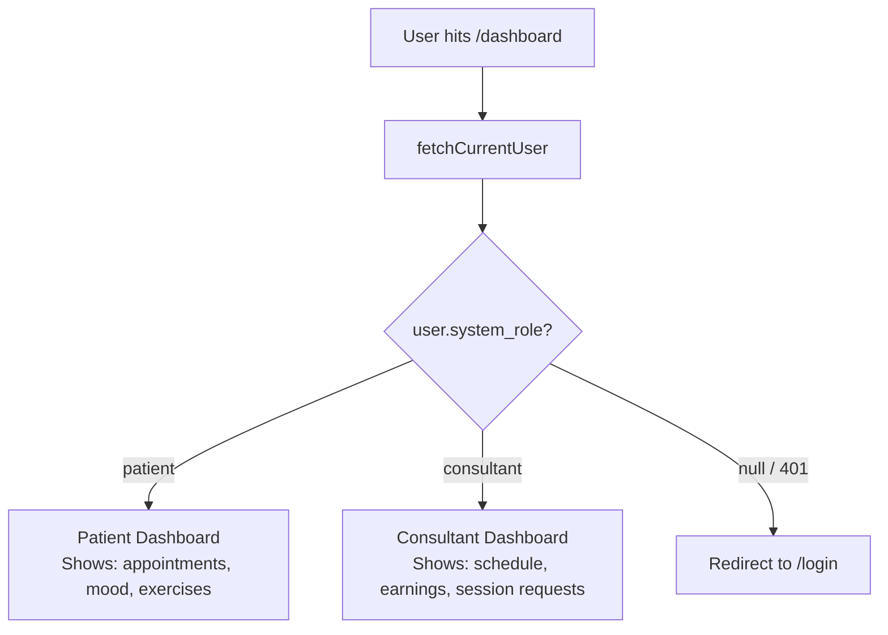
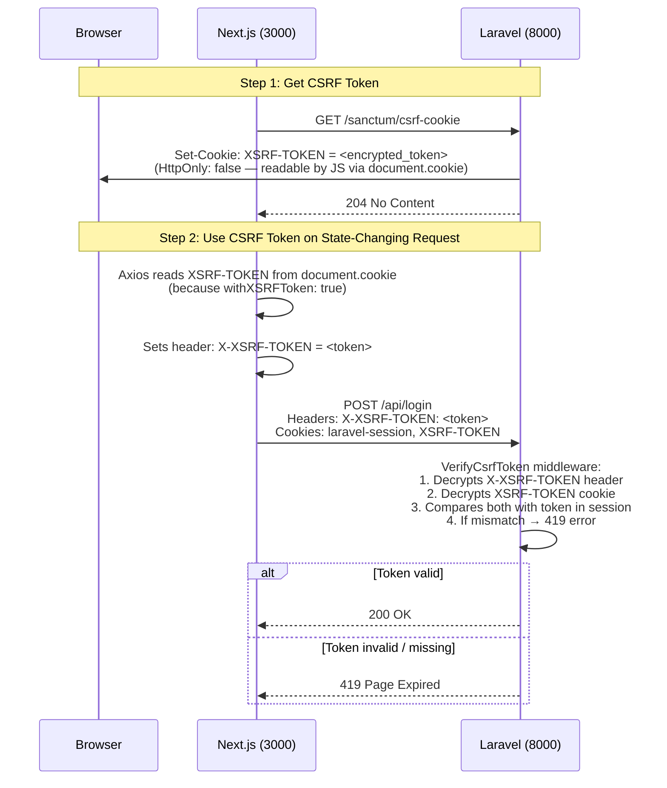
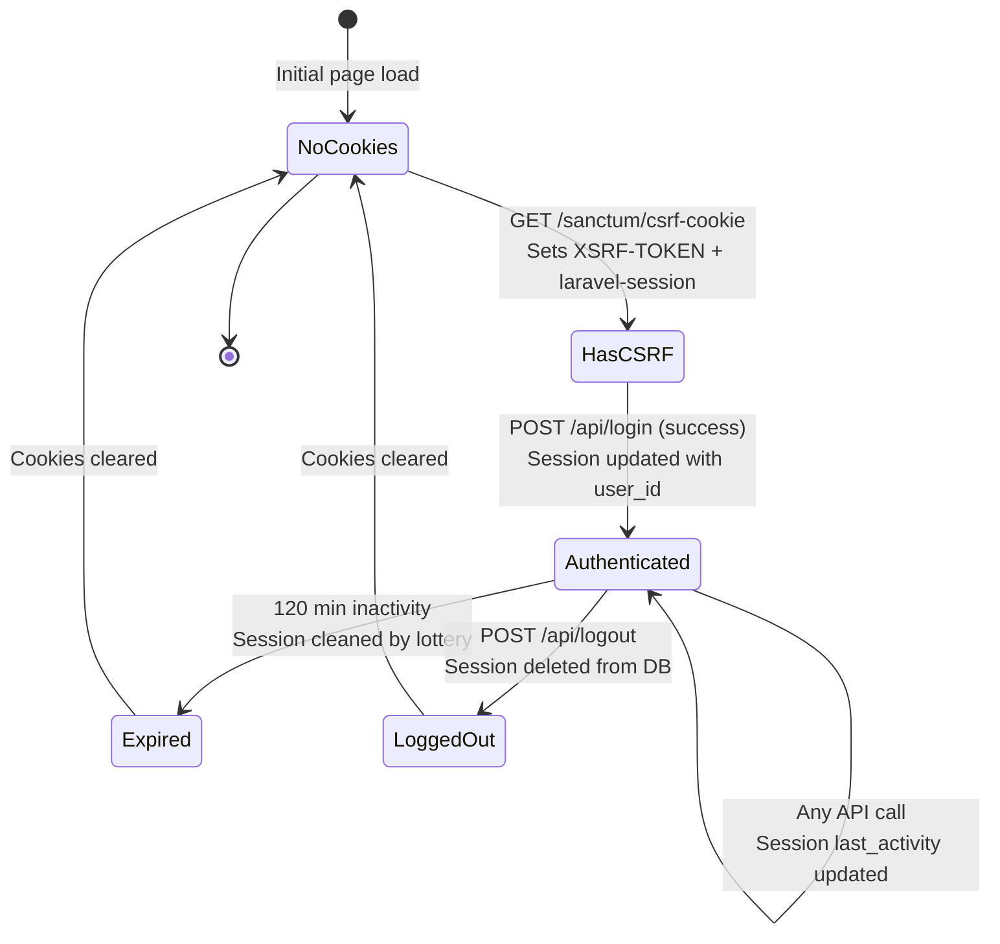

# Authentication System — CompanionX

## Table of Contents

- [Architecture Overview](#architecture-overview)
- [How PHP/Laravel Works Here](#how-phplaravel-works-here)
- [The Axios Instance](#the-axios-instance)
- [Flow 1: Registration](#flow-1-registration)
- [Flow 2: Login](#flow-2-login)
- [Flow 3: Session Validation (Every Page Load)](#flow-3-session-validation-every-page-load)
- [Flow 4: Logout](#flow-4-logout)
- [Route Protection Layers](#route-protection-layers)
- [Role-Based Access Control (RBAC)](#role-based-access-control-rbac)
- [CSRF Protection — Deep Dive](#csrf-protection--deep-dive)
- [Cookie Details](#cookie-details)
- [Middleware Pipeline (Backend)](#middleware-pipeline-backend)
- [Key Files Reference](#key-files-reference)
- [Security Considerations](#security-considerations)

---

## Architecture Overview

Two separate processes, connected by cookies at the browser level:

| Layer | Technology | URL | Role |
|-------|-----------|-----|------|
| **Frontend** | Next.js (React) | `localhost:3000` | SPA, UI rendering, route guarding |
| **Backend** | Laravel (PHP) | `localhost:8000` | Session store, auth logic, API, DB |

```
┌─────────────────────────────────────────────────────────────────────┐
│                          BROWSER                                    │
│                                                                     │
│  ┌──────────────────────┐         ┌──────────────────────────────┐  │
│  │   Next.js (React)    │  HTTP   │     Laravel (PHP)            │  │
│  │   localhost:3000      │────────▶│     localhost:8000            │  │
│  │                      │         │                              │  │
│  │  • React components  │◀────────│  • AuthController            │  │
│  │  • Client-side guards│  JSON   │  • Sanctum middleware        │  │
│  │  • Axios HTTP client │  + Set- │  • Session driver (DB)       │  │
│  │                      │  Cookie │  • CSRF verification         │  │
│  └──────────────────────┘         └──────────────────────────────┘  │
│                                                                     │
│  Cookies shared across both (same-origin from browser's POV):       │
│    • laravel-session  (session ID)                                  │
│    • XSRF-TOKEN       (CSRF token)                                  │
└─────────────────────────────────────────────────────────────────────┘
```

The browser treats both as same-origin because:
- Requests go from the browser (port 3000) to the API (port 8000)
- `withCredentials: true` on Axios sends cookies cross-port
- Laravel's CORS config (`config/cors.php`) allows `localhost:3000` with `supports_credentials: true`

---

## How PHP/Laravel Works Here

Laravel is a PHP framework that runs as a persistent HTTP server (via `php artisan serve` or a web server like Nginx). Here's how a request flows through it:

```
HTTP Request arrives at localhost:8000
        │
        ▼
┌─────────────────────────────────────────────────────┐
│  public/index.php  (entry point)                    │
│  Bootstraps the Laravel application                 │
└─────────────────────┬───────────────────────────────┘
                      │
                      ▼
┌─────────────────────────────────────────────────────┐
│  bootstrap/app.php                                  │
│  Configures:                                        │
│    • Routing (web.php, api.php)                     │
│    • Middleware ($middleware->statefulApi())         │
│    • Aliases ('patient', 'consultant')              │
│    • Exception handling                             │
└─────────────────────┬───────────────────────────────┘
                      │
                      ▼
┌─────────────────────────────────────────────────────┐
│  HTTP Kernel / Middleware Pipeline                  │
│                                                     │
│  For API routes, Laravel auto-applies:              │
│    1. EncryptCookies                                │
│    2. AddQueuedCookiesToResponse                    │
│    3. StartSession                                  │
│    4. ShareSessionFromCookie (reads laravel-session) │
│    5. VerifyCsrfToken (for web routes)              │
│    6. SubstituteBindings                            │
│                                                     │
│  $middleware->statefulApi() adds Sanctum's          │
│  stateful middleware stack to API routes.            │
└─────────────────────┬───────────────────────────────┘
                      │
                      ▼
┌─────────────────────────────────────────────────────┐
│  routes/api.php                                     │
│  Matches the URL to a controller method             │
│                                                     │
│  Example: POST /api/login → AuthController@login    │
└─────────────────────┬───────────────────────────────┘
                      │
                      ▼
┌─────────────────────────────────────────────────────┐
│  Controller (e.g. AuthController.php)               │
│                                                     │
│  • Validates input ($request->validate())           │
│  • Interacts with models (User::create, Auth::*)    │
│  • Returns JSON response                            │
└─────────────────────────────────────────────────────┘
```

### Key PHP Concepts Used

- **`Auth::attempt($credentials, $remember)`** — Validates email/password against the `users` table, starts a session if valid. The `true` second arg enables "remember me".
- **`Auth::login($user)`** — Programmatically logs in a user object (used after registration).
- **`$request->session()->regenerate()`** — Regenerates the session ID to prevent session fixation attacks.
- **`$request->session()->invalidate()`** — Destroys the entire session (used on logout).
- **`$request->user()`** — Returns the currently authenticated user from the session (via Sanctum).
- **`Hash::make($password)`** — Bcrypt-hashes a password before storing.
- **`response()->json($data)`** — Returns a JSON response with proper headers.

### Sanctum's Role

Sanctum is a Laravel package that provides authentication. It's configured in `config/sanctum.php`:

- **`guard => ['web']`** — Uses the `web` session guard (cookie-based), NOT API tokens.
- **`stateful` domains** — Includes `localhost:3000`, so Sanctum treats requests from that origin as "first-party" and issues session cookies.
- **`statefulApi()` middleware** — Applied in `bootstrap/app.php`, this tells Laravel to apply session/cookie middleware to API routes (normally only web routes get them).

This means Sanctum is acting as a **session-based authenticator** — it reads the `laravel-session` cookie, looks up the session in the `sessions` DB table, loads the associated user, and makes `$request->user()` available.

---

## The Axios Instance

All HTTP requests from the frontend go through a shared Axios instance (`lib/axios.ts`):

```typescript
const api = axios.create({
  baseURL: "http://localhost:8000",       // Laravel API
  headers: {
    "Content-Type": "application/json",
    Accept: "application/json",
  },
  withCredentials: true,                  // Send cookies with every request
  withXSRFToken: true,                    // Auto-attach X-XSRF-TOKEN header
  xsrfCookieName: "XSRF-TOKEN",          // Read this cookie
  xsrfHeaderName: "X-XSRF-TOKEN",       // Send as this header
});
```

**What `withCredentials: true` does:** Tells the browser to include cookies (`laravel-session`, `XSRF-TOKEN`) on cross-origin requests. Without this, the browser would NOT send cookies to `localhost:8000` from `localhost:3000`.

**What `withXSRFToken: true` does:** Before every request, Axios reads the `XSRF-TOKEN` cookie from `document.cookie` and attaches it as the `X-XSRF-TOKEN` header. Laravel's `VerifyCsrfToken` middleware then validates this header against the session.

---

## Flow 1: Registration



**What happens in PHP (simplified):**

```php
// AuthController@register (app/Http/Controllers/Api/AuthController.php:15)

// 1. Validate input
$request->validate([
    'first_name' => 'required|string|max:255',
    'email'      => 'required|string|email|max:255|unique:users',
    'password'   => ['required', 'confirmed', Password::defaults()],
    // ... more fields
]);

// 2. Create user in DB (password is bcrypt-hashed)
$user = User::create([...]);

// 3. If consultant, create a consultant profile
if ($systemRole === 'consultant') {
    ConsultantProfile::firstOrCreate(['user_id' => $user->id]);
}

// 4. Log the user in (stores user_id in session)
Auth::login($user);

// 5. Regenerate session ID (prevents session fixation)
$request->session()->regenerate();

// 6. Return user data as JSON
return response()->json(['user' => $user], 201);
```

**Files involved:**
- `companionx-web/app/register/page.tsx` — Form UI, calls `register()` from `lib/auth.ts`
- `companionx-web/lib/auth.ts:48` — `register()` calls `ensureCsrfCookie()` then `POST /api/register`
- `companionx-api/app/Http/Controllers/Api/AuthController.php:15` — `register()` method
- `companionx-api/routes/api.php:14` — `Route::post("/register", ...)`

---

## Flow 2: Login



**What happens in PHP:**

```php
// AuthController@login (app/Http/Controllers/Api/AuthController.php:56)

// 1. Validate
$fields = $request->validate([
    'email'    => 'required|string|email',
    'password' => 'required|string'
]);

// 2. Attempt login (Auth::attempt checks email + bcrypt(password))
//    Second arg `true` = remember me (sets remember_token cookie)
if (!Auth::attempt($fields, true)) {
    return response(['message' => 'Invalid credentials'], 401);
}

// 3. Regenerate session (security: prevents session fixation)
$request->session()->regenerate();

// 4. Return user
$user = $request->user();
return response(['user' => $user], 200);
```

**Files involved:**
- `companionx-web/app/login/page.tsx` — Form UI, calls `login()` on submit
- `companionx-web/lib/auth.ts:42` — `login()` calls `ensureCsrfCookie()` then `POST /api/login`
- `companionx-api/app/Http/Controllers/Api/AuthController.php:56` — `login()` method
- `companionx-api/routes/api.php:15` — `Route::post("/login", ...)`

---

## Flow 3: Session Validation (Every Page Load)

This is the **real auth check**. It runs on every protected page load.



**What happens in PHP:**

```php
// AuthController@me (app/Http/Controllers/Api/AuthController.php:87)

// $request->user() is populated by Sanctum's auth middleware.
// It reads the laravel-session cookie, looks up the session in
// the `sessions` table, and loads the associated user.

public function me(Request $request)
{
    return response()->json($request->user());
}
```

**The route is protected by `auth:sanctum` middleware:**

```php
// routes/api.php:17
Route::middleware("auth:sanctum")->group(function () {
    Route::get("/me", [AuthController::class, "me"]);
    // ... other protected routes
});
```

**How `auth:sanctum` works internally:**
1. Reads the `laravel-session` cookie from the request
2. Looks up the session ID in the `sessions` database table
3. Deserializes the session payload to find the `user_id`
4. Loads the `User` model from the `users` table
5. Attaches the user to the request (`$request->user()`)
6. If no valid session → returns 401

**Files involved:**
- `companionx-web/lib/auth.ts:33` — `fetchCurrentUser()` calls `GET /api/me`, returns `null` on error
- `companionx-web/app/dashboard/page.tsx:126` — Calls `fetchCurrentUser()` in `useEffect()`, redirects to `/login` if `null`
- `companionx-web/app/page.tsx:26` — Calls `fetchCurrentUser()` in Nav to show avatar/login buttons
- `companionx-api/app/Http/Controllers/Api/AuthController.php:87` — `me()` method

---

## Flow 4: Logout



**What happens in PHP:**

```php
// AuthController@logout (app/Http/Controllers/Api/AuthController.php:78)

// 1. Log out (removes user reference from session)
Auth::guard('web')->logout();

// 2. Invalidate session (deletes from DB, clears cookie)
$request->session()->invalidate();

// 3. Regenerate CSRF token (prevents token reuse)
$request->session()->regenerateToken();

return response(['message' => 'Logged out'], 200);
```

**Files involved:**
- `companionx-web/lib/auth.ts:54` — `logout()` calls `ensureCsrfCookie()` then `POST /api/logout`
- `companionx-api/app/Http/Controllers/Api/AuthController.php:78` — `logout()` method

---

## Route Protection Layers

There are **two layers** of route protection in this system:

### Layer 1: Next.js Middleware (Currently Disabled)

```typescript
// companionx-web/middleware.ts
export function middleware(_request: NextRequest) {
  return NextResponse.next(); // Always passes through
}

export const config = {
  matcher: [], // Empty — no routes matched
};
```

**Status:** Currently a no-op. The middleware does nothing — it passes all requests through. The original design was to check for the `laravel-session` cookie and redirect unauthenticated users, but this is now handled client-side.

### Layer 2: Client-Side Guard (Active)

Every protected page calls `fetchCurrentUser()` on mount:

```typescript
// app/dashboard/page.tsx:123
useEffect(() => {
  fetchCurrentUser()
    .then((currentUser) => {
      if (!currentUser) {
        router.push("/login"); // Redirect if not authenticated
        return;
      }
      // ... load page data
    });
}, [router]);
```

**This is the actual auth gate.** It calls `GET /api/me`, and if Laravel returns 401 (invalid/expired session), the user is redirected to `/login`.



**Important:** The cookie presence check is NOT a security measure. A user could manually set a `laravel-session` cookie with any value and pass any hypothetical middleware check. The real validation is always `GET /api/me` — Laravel checks the session against the database.

---

## Role-Based Access Control (RBAC)

The system has two roles: `patient` and `consultant`. Role enforcement happens at **three levels**:

### Level 1: Database

The `users` table has a `system_role` column (`patient` or `consultant`).

### Level 2: Backend Middleware

Two custom middleware classes enforce role-based access on API routes:

```php
// EnsureUserIsPatient (app/Http/Middleware/EnsureUserIsPatient.php)
public function handle(Request $request, Closure $next)
{
    if ($request->user() && $request->user()->system_role === 'patient') {
        return $next($request);
    }
    return response()->json(['message' => 'Unauthorized. Only patients can access this.'], 403);
}

// EnsureUserIsConsultant (app/Http/Middleware/EnsureUserIsConsultant.php)
public function handle(Request $request, Closure $next)
{
    if ($request->user() && $request->user()->system_role === 'consultant') {
        return $next($request);
    }
    return response()->json(['message' => 'Access denied. Consultant role required.'], 403);
}
```

Registered as aliases in `bootstrap/app.php`:

```php
$middleware->alias([
    'patient'    => \App\Http\Middleware\EnsureUserIsPatient::class,
    'consultant' => \App\Http\Middleware\EnsureUserIsConsultant::class,
]);
```

### Level 3: Route Groups

Routes are grouped by role in `routes/api.php`:

```php
Route::middleware("auth:sanctum")->group(function () {
    // Shared authenticated routes (logout, /me)
    Route::post("/logout", ...);
    Route::get("/me", ...);

    // Patient-only routes
    Route::middleware("patient")->group(function () {
        Route::get("/dashboard/summary", ...);
        Route::get("/journal", ...);
        Route::post("/booking/hold", ...);
        // ... more patient routes
    });

    // Consultant-only routes
    Route::middleware("consultant")->group(function () {
        Route::get("/consultant/dashboard", ...);
        Route::post("/consultant/slots", ...);
        // ... more consultant routes
    });
});
```

### Level 4: Frontend Branching

The dashboard page renders different UI based on role:

```typescript
// app/dashboard/page.tsx:197
if (user?.system_role === "consultant") {
    return <ConsultantDashboard />;
}
// Otherwise render patient dashboard
```



---

## CSRF Protection — Deep Dive

Cross-Site Request Forgery (CSRF) protection prevents malicious sites from making authenticated requests on behalf of a user.

### How It Works End-to-End



### Why Two Tokens?

- **`XSRF-TOKEN` cookie** — Set by Laravel, readable by JavaScript (HttpOnly: false). This is the "double submit" pattern.
- **Session CSRF token** — Stored server-side in the session. Laravel compares the header value against this.
- **`X-XSRF-TOKEN` header** — Sent by Axios on every request. Laravel validates it matches the session token.

The `XSRF-TOKEN` cookie is encrypted by Laravel using `APP_KEY`. Even if an attacker can read the cookie name, they can't forge a valid token without the encryption key.

### Which Methods Need CSRF?

All state-changing methods: `POST`, `PUT`, `PATCH`, `DELETE`. `GET` requests do not need CSRF tokens.

---

## Cookie Details

### `laravel-session`

| Property | Value |
|----------|-------|
| **Name** | `laravel-session` (derived from `Str::slug(APP_NAME) . '-session'`) |
| **Value** | Encrypted session ID (random string) |
| **HttpOnly** | `true` (not readable by JavaScript) |
| **SameSite** | `lax` |
| **Path** | `/` |
| **Domain** | null (current domain only) |
| **Secure** | env-dependent (`SESSION_SECURE_COOKIE`) |
| **Lifetime** | 120 minutes (configurable via `SESSION_LIFETIME`) |

The session ID maps to a row in the `sessions` database table:

| Column | Contents |
|--------|----------|
| `id` | The session ID (matches the cookie value) |
| `user_id` | The authenticated user's ID (null if not logged in) |
| `ip_address` | Client IP |
| `user_agent` | Browser user agent |
| `payload` | Serialized session data (encrypted) |
| `last_activity` | Timestamp of last activity |

### `XSRF-TOKEN`

| Property | Value |
|----------|-------|
| **Name** | `XSRF-TOKEN` |
| **Value** | Encrypted CSRF token |
| **HttpOnly** | `false` (readable by JavaScript — this is intentional) |
| **SameSite** | `lax` |
| **Path** | `/` |

### Cookie Lifecycle



---

## Middleware Pipeline (Backend)

Here's the full middleware stack for an authenticated API request like `POST /api/journal`:

```
Request: POST /api/journal
Headers: Cookie: laravel-session=abc123; XSRF-TOKEN=xyz
         X-XSRF-TOKEN: xyz
         Content-Type: application/json

    │
    ▼
┌──────────────────────────────────────────┐
│ 1. EncryptCookies                        │
│    Decrypts: laravel-session, XSRF-TOKEN │
│    (Uses APP_KEY for decryption)         │
└──────────────────┬───────────────────────┘
                   │
                   ▼
┌──────────────────────────────────────────┐
│ 2. AddQueuedCookiesToResponse            │
│    Attaches any queued cookies to the    │
│    response (none on request, but        │
│    prepared for response)                │
└──────────────────┬───────────────────────┘
                   │
                   ▼
┌──────────────────────────────────────────┐
│ 3. StartSession                          │
│    Reads laravel-session cookie          │
│    Loads session from `sessions` table   │
│    Makes session data available          │
└──────────────────┬───────────────────────┘
                   │
                   ▼
┌──────────────────────────────────────────┐
│ 4. ShareSessionFromCookie (Sanctum)      │
│    Ensures session is shared across      │
│    middleware and controllers             │
└──────────────────┬───────────────────────┘
                   │
                   ▼
┌──────────────────────────────────────────┐
│ 5. AuthenticateSession (Sanctum)         │
│    Checks if user_id in session matches  │
│    a valid user in DB                    │
│    If not → 401                          │
└──────────────────┬───────────────────────┘
                   │
                   ▼
┌──────────────────────────────────────────┐
│ 6. VerifyCsrfToken                       │
│    Compares X-XSRF-TOKEN header with     │
│    token stored in session               │
│    If mismatch → 419                     │
└──────────────────┬───────────────────────┘
                   │
                   ▼
┌──────────────────────────────────────────┐
│ 7. Route Matched: auth:sanctum           │
│    Sanctum resolves user from session    │
│    $request->user() now available        │
└──────────────────┬───────────────────────┘
                   │
                   ▼
┌──────────────────────────────────────────┐
│ 8. Route Matched: patient (alias)        │
│    EnsureUserIsPatient checks:           │
│    $request->user()->system_role ===     │
│    'patient'                             │
│    If not → 403                          │
└──────────────────┬───────────────────────┘
                   │
                   ▼
┌──────────────────────────────────────────┐
│ 9. Controller: JournalController@index   │
│    Executes business logic               │
│    Returns JSON response                 │
└──────────────────────────────────────────┘
```

---

## Key Files Reference

### Frontend (`companionx-web/`)

| File | Purpose |
|------|---------|
| `lib/axios.ts` | Axios instance: `baseURL`, `withCredentials`, `withXSRFToken` |
| `lib/auth.ts` | `ensureCsrfCookie()`, `login()`, `register()`, `logout()`, `fetchCurrentUser()` |
| `middleware.ts` | Next.js middleware (currently disabled/no-op) |
| `app/login/page.tsx` | Login form — calls `login()`, redirects to `/dashboard` |
| `app/register/page.tsx` | Registration form — calls `register()`, redirects to `/dashboard` or `/onboarding` |
| `app/dashboard/page.tsx` | Dashboard — calls `fetchCurrentUser()`, branches by role |
| `app/dashboard/layout.tsx` | Dashboard layout wrapper (sidebar) |
| `app/page.tsx` | Landing page — Nav calls `fetchCurrentUser()` to show avatar or login buttons |

### Backend (`companionx-api/`)

| File | Purpose |
|------|---------|
| `app/Http/Controllers/Api/AuthController.php` | `register()`, `login()`, `logout()`, `me()` |
| `routes/api.php` | Route definitions with middleware groups |
| `bootstrap/app.php` | Middleware registration: `statefulApi()`, aliases (`patient`, `consultant`) |
| `app/Http/Middleware/EnsureUserIsPatient.php` | Checks `system_role === 'patient'` |
| `app/Http/Middleware/EnsureUserIsConsultant.php` | Checks `system_role === 'consultant'` |
| `config/sanctum.php` | Stateful domains, guard (`web`), middleware classes |
| `config/session.php` | Session driver (`database`), cookie name (`laravel-session`), lifetime (120 min) |
| `config/cors.php` | Allowed origins (`localhost:3000`), `supports_credentials: true` |

---

## Security Considerations

1. **Session stored in DB** — `SESSION_DRIVER=database`. Sessions persist across server restarts. Session data is in the `sessions` table.

2. **Session lifetime** — 120 minutes of inactivity. Expired sessions are cleaned by a "lottery" system (2% chance per request).

3. **Session fixation prevention** — `session()->regenerate()` is called on both login and register, generating a new session ID after authentication state changes.

4. **CSRF protection** — All state-changing requests require a valid `X-XSRF-TOKEN` header. Axios handles this automatically via `withXSRFToken: true`.

5. **Cookie security** — `laravel-session` is `httpOnly: true` (not readable by JS), `sameSite: lax` (blocks cross-site POST). `XSRF-TOKEN` is `httpOnly: false` intentionally (Axios needs to read it).

6. **Password hashing** — `Hash::make()` uses bcrypt with a cost factor of 12 (Laravel default).

7. **Input validation** — All registration fields are validated server-side. Email and phone must be unique. Password must meet `Password::defaults()` requirements.

8. **Role enforcement** — Multiple layers: DB column, backend middleware, frontend branching. A patient cannot access consultant endpoints and vice versa (403 response).

9. **CORS** — Only `localhost:3000` is allowed. `supports_credentials: true` enables cookie sharing. `allowed_methods: ['*']` allows all HTTP methods.

10. **`AuthenticateSession` middleware** — Enabled in Sanctum config (`config/sanctum.php:79`). This middleware checks that the session's user still exists in the DB on every request, helping invalidate sessions if a user is deleted.
